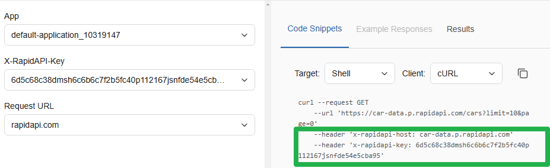
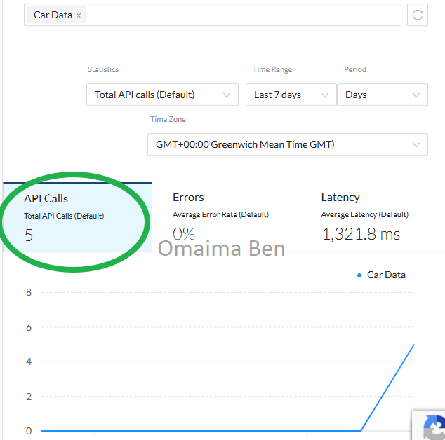
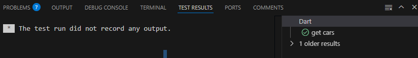
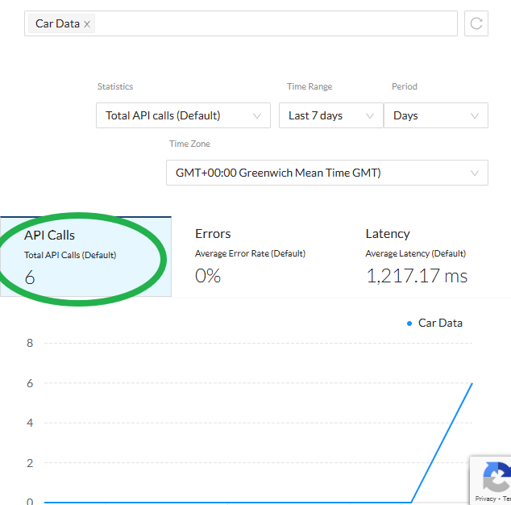
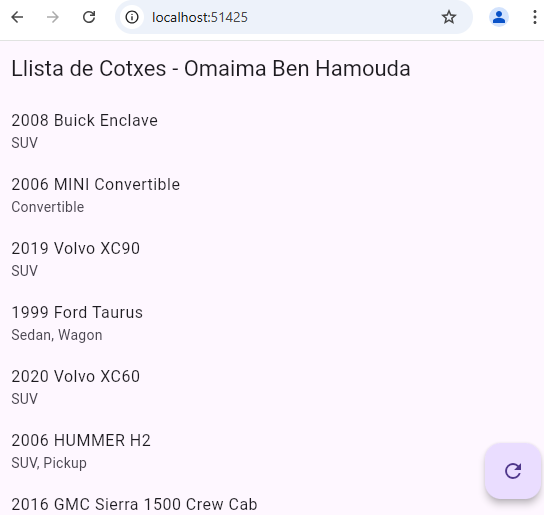
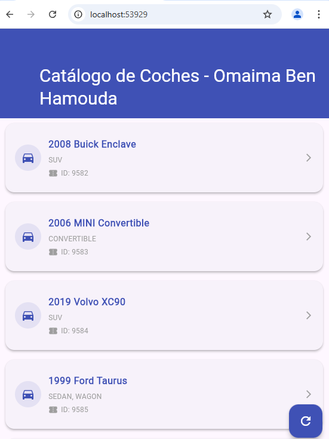
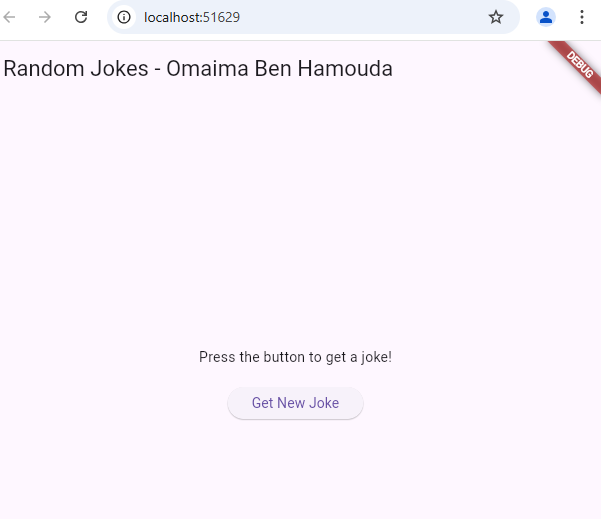

# Ejercicio 1 - Consumo de API de Coches

## Descripción General
Aplicación Flutter para obtener datos de coches desde una API externa. Implementa:  
- **Modelado de datos**  
- **Conexión HTTP**  
- **Manejo de JSON**  
- **Testing unitario**

---

## 🛠 Componentes Principales

### 1. Modelo `Car`
**Responsabilidad**: Representar la estructura de datos de los coches.  
- **Campos**:  
  - `id` (entero único)  
  - `year` (año de fabricación)  
  - `make` (marca)  
  - `model` (modelo)  
  - `type` (tipo de vehículo)  

- **Métodos clave**:  
  - `fromMapToCarObject()`: Constructor que mapea JSON → Objeto Dart  
  - `fromObjectToMap()`: Convierte objeto Dart → Mapa JSON  

---

### 2. Servicio `CarHttpService`
**Responsabilidad**: Gestionar la comunicación con la API.  

- **Configuración**:  
  - URL base del servidor  
  - Headers para autenticación (API key y host)  

- **Funcionalidad principal**:  
  - `getCars()`: Realiza petición GET a `/cars`, procesa respuesta y maneja errores HTTP  

---

### 3. Test Unitario
**Objetivo**: Validar el correcto funcionamiento del servicio.  

- **Pruebas implementadas**:  
  - Verifica que se obtengan 10 coches  
  - Comprueba IDs específicos en primera/última posición  
  - Detecta errores en la conexión  





---

## 📦 Dependencias Utilizadas
- **`http`**: Para realizar peticiones HTTP (añadida en `pubspec.yaml`)  
- **`dart:convert`**: Serialización/deserialización JSON (nativo en Dart)  
- **`flutter_test`**: Framework para testing (incluido en Flutter SDK)  

---

## ⚙ Configuración Adicional
- **Permiso de Internet**: Añadido en `AndroidManifest.xml` para permitir conexiones:  
  ```xml
  <uses-permission android:name="android.permission.INTERNET" />


# Exercici 2

##  Qué és el que aprendrem a aquest vídeo? 
Aprendrem a gestionar un estat global de l'aplicació utilitzant el paquet Provider. Això permet compartir dades (com un comptador) entre diferents parts de l'aplicació de forma eficient i reactiva.
## Quina comanda es fa servir al vídeo per a crear una nova aplicació flutter?
La comanda utilitzada és: flutter create nova_applicacio
## Com es treu el debuguer banner? Afegeix la línia de codi que fan servir al vídeo per treure’l
Es desactiva afegint la propietat debugShowCheckedModeBanner: false al MaterialApp:
MaterialApp(
  debugShowCheckedModeBanner: false, // Elimina la banner de debug
  // ... Altres configuracions
)


## Introducción
Este informe detalla la implementación de una aplicación Flutter que gestiona y muestra una lista de coches obtenidos a través de un servicio HTTP. Se utiliza el paquete `provider` para la gestión del estado de la aplicación.

## Librerías Utilizadas
- `flutter/foundation.dart`: Proporciona herramientas esenciales para la gestión del estado en Flutter.
- `flutter/material.dart`: Biblioteca principal para el diseño de interfaces en Flutter.
- `provider.dart`: Facilita la implementación del patrón Provider para la gestión del estado.
- `carHttpService.dart`: Manejador de peticiones HTTP para obtener datos de coches.
- `car.dart`: Modelo de datos para representar los coches.

## Estructura del Código

### CarProvider (Gestor del Estado)
Ubicado en `carProvider.dart`, esta clase gestiona la lista de coches y su estado.

#### Atributos:
- `_carService`: Instancia de `CarHttpService` para obtener los datos de coches.
- `_cars`: Lista de coches obtenidos del servicio.
- `_isLoading`: Indica si los datos están siendo cargados.
- `_error`: Almacena mensajes de error en caso de fallo.

#### Métodos:
- `fetchCars()`: Obtiene la lista de coches desde el servicio HTTP y actualiza el estado de la aplicación.

### MyApp (Interfaz de Usuario)
Ubicado en `main.dart`, esta clase configura la aplicación Flutter y define la interfaz.

#### Componentes Principales:
- `ChangeNotifierProvider`: Proporciona `CarProvider` a la aplicación.
- `MaterialApp`: Contenedor principal de la aplicación.
- `Scaffold`: Estructura básica de la UI con `AppBar` y `ListView`.
- `Consumer<CarProvider>`: Detecta cambios en `CarProvider` y actualiza la UI según corresponda.
- `FloatingActionButton`: Botón para refrescar la lista de coches.

## Funcionamiento de la Aplicación
1. Al iniciar, `CarProvider` se inicializa y está disponible globalmente.
2. La UI muestra un `CircularProgressIndicator` mientras se cargan los datos.
3. Si ocurre un error, se muestra un mensaje en pantalla.
4. Si los datos se cargan correctamente, se muestra una lista de coches.
5. El usuario puede actualizar la lista mediante el `FloatingActionButton`.

## Conclusión
La implementación hace uso efectivo del patrón Provider para gestionar el estado y actualizar la interfaz de usuario de forma reactiva. Además, el uso de servicios HTTP permite obtener datos dinámicos, haciendo que la aplicación sea más flexible y escalable.


## Librerías Utilizadas
- `flutter/foundation.dart`: Proporciona herramientas esenciales para la gestión del estado en Flutter.
- `flutter/material.dart`: Biblioteca principal para el diseño de interfaces en Flutter.
- `provider.dart`: Facilita la implementación del patrón Provider para la gestión del estado.
- `carHttpService.dart`: Manejador de peticiones HTTP para obtener datos de coches.
- `car.dart`: Modelo de datos para representar los coches.

## Estructura del Código

### CarProvider (Gestor del Estado)
Ubicado en `carProvider.dart`, esta clase gestiona la lista de coches y su estado.

#### Atributos:
- `_carService`: Instancia de `CarHttpService` para obtener los datos de coches.
- `_cars`: Lista de coches obtenidos del servicio.
- `_isLoading`: Indica si los datos están siendo cargados.
- `_error`: Almacena mensajes de error en caso de fallo.

#### Métodos:
- `fetchCars()`: Obtiene la lista de coches desde el servicio HTTP y actualiza el estado de la aplicación.

### MyApp (Interfaz de Usuario)
Ubicado en `main.dart`, esta clase configura la aplicación Flutter y define la interfaz.

#### Componentes Principales:
- `ChangeNotifierProvider`: Proporciona `CarProvider` a la aplicación.
- `MaterialApp`: Contenedor principal de la aplicación.
- `Scaffold`: Estructura básica de la UI con `AppBar` y `ListView`.
- `Consumer<CarProvider>`: Detecta cambios en `CarProvider` y actualiza la UI según corresponda.
- `FloatingActionButton`: Botón para refrescar la lista de coches.

## Funcionamiento de la Aplicación
1. Al iniciar, `CarProvider` se inicializa y está disponible globalmente.
2. La UI muestra un `CircularProgressIndicator` mientras se cargan los datos.
3. Si ocurre un error, se muestra un mensaje en pantalla.
4. Si los datos se cargan correctamente, se muestra una lista de coches.
5. El usuario puede actualizar la lista mediante el `FloatingActionButton`.

## Conclusión
La implementación hace uso efectivo del patrón Provider para gestionar el estado y actualizar la interfaz de usuario de forma reactiva. Además, el uso de servicios HTTP permite obtener datos dinámicos, haciendo que la aplicación sea más flexible y escalable.




# Exericici 3

## Objetivo
Desarrollar una aplicación Flutter que consume datos de una API REST ([Car Data API](https://rapidapi.com/principalapis/api/car-data/)) utilizando el patrón Provider para la gestión del estado, siguiendo las mejores prácticas de arquitectura limpia.

---

## Estructura del Proyecto

### Gestión de Estado (carProvider.dart)
Implementación del patrón Provider con ChangeNotifier:

dart
Copy
class CarProvider with ChangeNotifier {
  List<Car> _cars = [];
  bool _isLoading = false;
  String _error = '';

  Future<void> getCarsData() async {
    _isLoading = true;
    notifyListeners();
    
    try {
      _cars = await CarHttpService().getCars();
      _error = '';
    } catch (e) {
      _error = "Error: ${e.toString()}";
    } finally {
      _isLoading = false;
      notifyListeners();
    }
  }
}
###  Interfaz de Usuario (main.dart)
Diseño Mejorado:

SliverAppBar con efecto de scroll

Tarjetas personalizadas con bordes redondeados

Sistema de carga y manejo de errores visual

Botón flotante de actualización

dart
Copy
SliverList(
  delegate: SliverChildBuilderDelegate(
    (context, index) => Card(
      margin: EdgeInsets.all(8),
      child: ListTile(
        leading: Icon(Icons.directions_car),
        title: Text('${car.year} ${car.make}'),
        subtitle: Text(car.type),
      ),
    ),
  ),
)
Componente	Detalle
Diseño Visual	Degradados, sombras, iconos temáticos, tipografía consistente
Experiencia UX	Pull-to-refresh, feedback visual de carga, reintento automático en errores
Performance	Paginación implícita con limit=10, caché de resultados
Mantenibilidad	Separación clara de capas (modelo-vista-controlador)
Ejecución de la Aplicación
Agregar API Key válida de RapidAPI en car_service.dart

dependencies:
  flutter:
    sdk: flutter
  http: ^0.13.5        # Para llamadas HTTP
  provider: ^6.0.5     # Gestión de estado
  google_fonts: ^3.0.1 # Fuentes personalizadas (opcional)




# Exercici 4: Acudits

## Descripció
Aquesta aplicació mostra acudits aleatoris fent ús de l'API `https://api.sampleapis.com/jokes/goodJokes`. Cada vegada que l'usuari prem el botó, es fa una nova petició a l'API per obtenir un nou acudit.

## Estructura del projecte
El projecte està estructurat seguint el patró MVC (Model - Vista - Controlador):

```
|-- lib/
    |-- models/
        |-- joke.dart  # Definició del model Joke
    |-- controllers/
        |-- jokeService.dart  # Lògica de connexió amb l'API
    |-- views/
        |-- jokeScreen.dart  # Pantalla principal amb la UI
    |-- main.dart  # Punt d'entrada de l'aplicació
```

## Fitxers principals

### 1. Model: `joke.dart`
Definició del model `Joke`, que representa un acudit rebut de l'API.

```dart
class Joke {
  final String setup;
  final String punchline;

  Joke({required this.setup, required this.punchline});

  factory Joke.fromJson(Map<String, dynamic> json) {
    return Joke(
      setup: json['setup'],
      punchline: json['punchline'],
    );
  }
}
```

### 2. Controlador: `jokeService.dart`
Aquest servei fa la petició HTTP a l'API i retorna un acudit aleatori.

```dart
import 'dart:convert';
import 'dart:math';
import 'package:http/http.dart' as http;
import '../models/joke.dart';

class JokeService {
  static Future<Joke?> fetchRandomJoke() async {
    try {
      final response = await http.get(Uri.parse('https://api.sampleapis.com/jokes/goodJokes'));
      if (response.statusCode == 200) {
        List<dynamic> jsonList = jsonDecode(response.body);
        List<Joke> jokes = jsonList.map((json) => Joke.fromJson(json)).toList();
        if (jokes.isEmpty) return null;
        return jokes[Random().nextInt(jokes.length)];
      } else {
        return null;
      }
    } catch (e) {
      return null;
    }
  }
}
```

### 3. Vista: `jokeScreen.dart`
La pantalla principal de l'aplicació, on es mostra l'acudit i es permet obtenir-ne un de nou.

```dart
import 'package:flutter/material.dart';
import '../models/joke.dart';
import '../controllers/jokeService.dart';

class JokeScreen extends StatefulWidget {
  const JokeScreen({super.key});

  @override
  State<JokeScreen> createState() => _JokeScreenState();
}

class _JokeScreenState extends State<JokeScreen> {
  Joke? _currentJoke;
  bool _isLoading = false;
  String? _errorMessage;

  Future<void> _fetchNewJoke() async {
    setState(() {
      _isLoading = true;
      _errorMessage = null;
    });
    try {
      Joke? newJoke = await JokeService.fetchRandomJoke();
      setState(() {
        _currentJoke = newJoke;
        if (newJoke == null) _errorMessage = 'Failed to load joke.';
      });
    } catch (e) {
      setState(() => _errorMessage = 'An error occurred: ${e.toString()}');
    } finally {
      setState(() => _isLoading = false);
    }
  }

  @override
  Widget build(BuildContext context) {
    return Scaffold(
      appBar: AppBar(title: const Text('Random Jokes')),
      body: Center(
        child: Padding(
          padding: const EdgeInsets.all(16.0),
          child: Column(
            mainAxisAlignment: MainAxisAlignment.center,
            children: [
              if (_isLoading)
                const CircularProgressIndicator()
              else if (_errorMessage != null)
                Text(_errorMessage!, style: const TextStyle(color: Colors.red))
              else if (_currentJoke != null)
                Column(
                  children: [
                    Text(_currentJoke!.setup, style: const TextStyle(fontSize: 18, fontWeight: FontWeight.bold)),
                    const SizedBox(height: 8),
                    Text(_currentJoke!.punchline, style: const TextStyle(fontSize: 16, fontStyle: FontStyle.italic)),
                  ],
                )
              else
                const Text('Press the button to get a joke!'),
              const SizedBox(height: 20),
              ElevatedButton(
                onPressed: _isLoading ? null : _fetchNewJoke,
                child: const Text('Get New Joke'),
              ),
            ],
          ),
        ),
      ),
    );
  }
}
```

### 4. `main.dart`
Punt d'entrada de l'aplicació, que inicialitza `JokeScreen`.

```dart
import 'package:flutter/material.dart';
import 'views/jokeScreen.dart';

void main() => runApp(const MyApp());

class MyApp extends StatelessWidget {
  const MyApp({super.key});

  @override
  Widget build(BuildContext context) {
    return MaterialApp(
      title: 'Jokes App',
      theme: ThemeData(primarySwatch: Colors.blue),
      home: const JokeScreen(),
    );
  }
}



